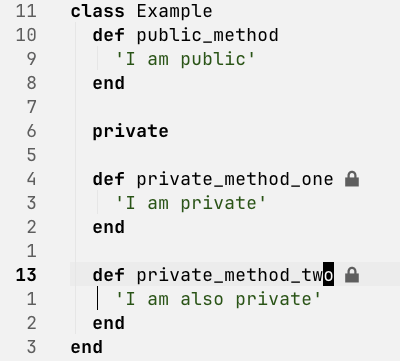

# private-ruby.nvim

Shows private Ruby methods with indicators in Neovim.



## Installation

### [lazy.nvim](https://lazy.folke.io/)

```lua
{
  'l-lin/private-ruby.nvim',
  ft = 'ruby',
  opts = {
    -- Those are the default values:
    indicator = {
      text = '',                -- Indicator text (max 2 chars for gutter)
      hl = 'DiagnosticHint',    -- Highlight group
      position = 'virtual_text', -- 'virtual_text' or 'gutter'
    },
    detect = {
      kind = 'auto',          -- Detection mode (see below)
    },
  },
}
```

### Detection Modes

The `detect.kind` option controls how private methods are detected:

| Mode | Behavior | Use When |
|------|----------|----------|
| `auto` | Try Tree-sitter first, fallback to regex if unavailable | Default - works everywhere |
| `treesitter` | Use only Tree-sitter, no fallback (returns empty if unavailable) | You want accurate detection and have Tree-sitter installed |
| `regex` | Use only regex-based detection, no fallback | Tree-sitter is unavailable or you prefer regex |

## Commands

- `:PrivateRubyRefresh` - Manually refresh indicators
- `:PrivateRubyClear` - Manually clear indicators

## Limitations

This version uses regex-based detection. Known limitations:

- Does not handle `private :method_name` symbol syntax
- Does not handle `private_class_method`
- May miscount `end` keywords in complex code (heredocs, inline blocks)
- Metaprogramming-defined methods are not detected

## Development

```bash
mise run test   # Run tests with mini.test
mise run smoke  # Smoke test: load plugin
```

## License

MIT
